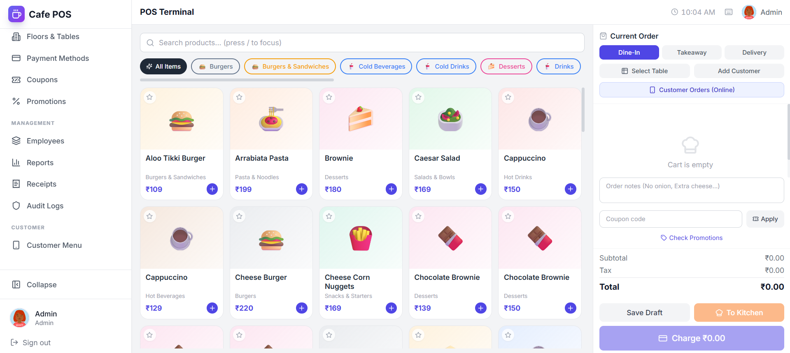
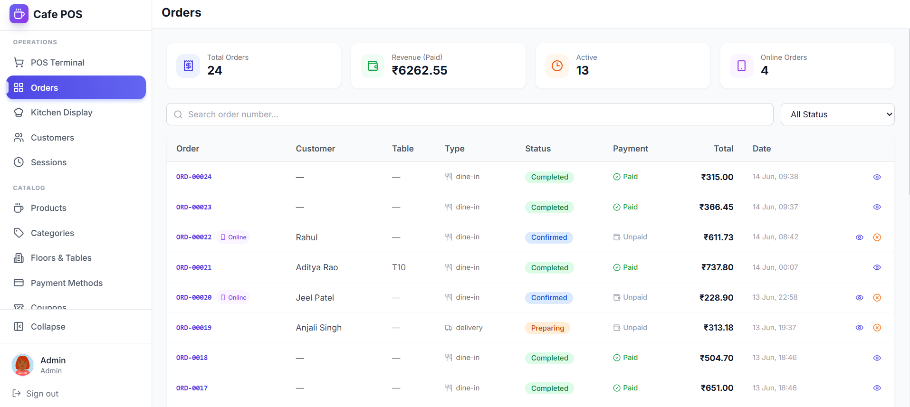
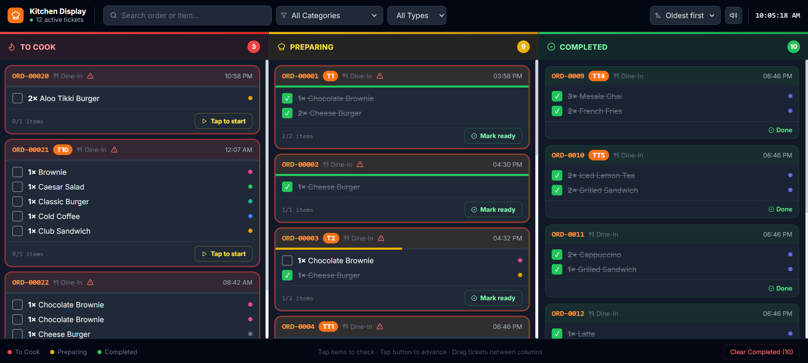
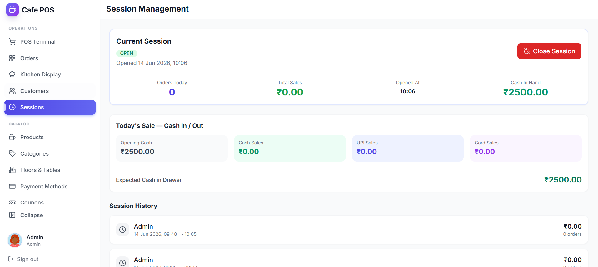
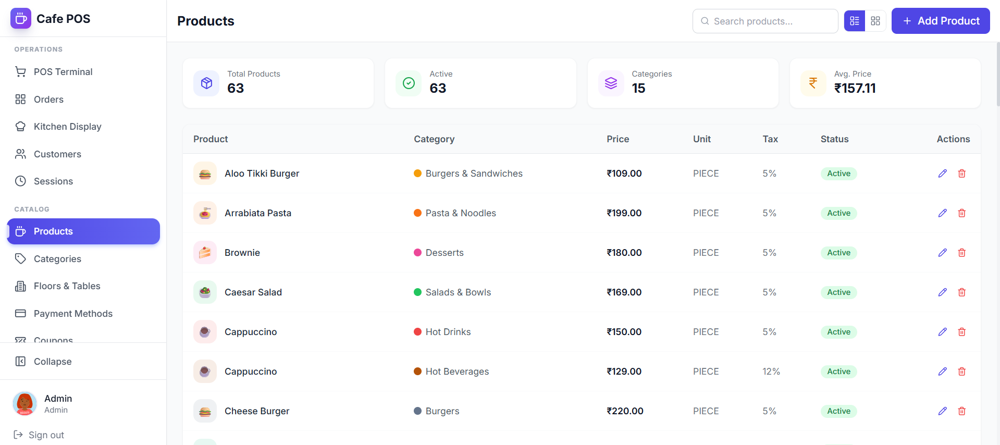

# Cafe POS — Restaurant Point of Sale & Kitchen Display System

A full-stack Restaurant POS system built with Next.js, Node.js, PostgreSQL (Prisma), and Socket.IO.

## Tech Stack

**Frontend:** Next.js 14, TypeScript, Tailwind CSS, React Query, Socket.IO Client, Recharts, Lucide Icons
**Backend:** Node.js, Express.js, TypeScript, PostgreSQL with Prisma ORM, JWT Auth, Socket.IO

## Features

- JWT Authentication with role-based access (Admin / Employee / Cashier)
- Auto POS session on login, with session open/close and closing summary
- Product & Category management (with color coding throughout UI), list/grid view toggle
- Floor & Table management with real-time status updates
- Full POS Terminal: product grid, category filters, cart, discounts, notes
- Coupon codes & automated promotions (product-based / order-based)
- Payment processing: Cash, UPI QR code, Card — including split payments
- Kitchen Display System (KDS) with real-time Socket.IO updates
- Order status tracking: Draft → Pending → Confirmed → Preparing → Ready → Served → Completed
- Item-level kitchen completion tracking
- Customer management (list/grid views with quick edit/delete)
- Employee management with role assignment & password reset
- Receipts (with email delivery) and audit logs
- Reporting & analytics dashboard (today / week / month)

## Screenshots

| POS Terminal | Orders |
|---|---|
|  |  |

| Kitchen Display | Session Management |
|---|---|
|  |  |

| Products |
|---|
|  |

## Prerequisites

- Node.js 18+
- PostgreSQL 14+ running locally (default setup uses port 5432)

## Project Structure

```
odoo-cafe-pos/
├── docker-compose.yml      Postgres + backend + frontend containers
├── backend/
│   ├── prisma/
│   │   ├── schema.prisma   Database models (User, Order, Product, etc.)
│   │   └── migrations/     SQL migration history
│   └── src/
│       ├── controllers/    Business logic
│       ├── routes/         REST API routes (auth, products, orders, reports, ...)
│       ├── middleware/      JWT auth middleware
│       ├── lib/             Prisma client, Socket.IO setup
│       ├── utils/           Helpers (PDF/receipt, etc.)
│       ├── seed.ts          Base seed: categories, veg menu, customers, tables, users
│       ├── seedDemo.ts      Demo seed: sample orders, sessions, coupons, promotions
│       └── index.ts         Express + Socket.IO server entry point
└── frontend/src/
    ├── app/
    │   ├── (auth)/          Login, Signup
    │   ├── (pos)/            POS terminal + all admin pages
    │   │   ├── pos/           POS terminal (cart, checkout, payments)
    │   │   ├── products/      Product management
    │   │   ├── categories/    Category management
    │   │   ├── customers/     Customer management
    │   │   ├── employees/     Employee/user management
    │   │   ├── floors/        Floor & table management
    │   │   ├── orders/        Order history
    │   │   ├── coupons/       Coupon codes
    │   │   ├── promotions/    Automated promotions
    │   │   ├── payment-methods/ Payment method config
    │   │   ├── receipts/      Receipts list
    │   │   ├── sessions/      POS session history
    │   │   ├── reports/       Analytics dashboard
    │   │   └── audit-logs/    Audit trail
    │   └── kds/               Kitchen Display System
    ├── components/           Reusable UI (Modal, Sidebar, PageLayout, etc.)
    ├── contexts/             AuthContext, CartContext
    ├── lib/                  Axios API client, Socket.IO
    └── types/                TypeScript interfaces
```

## Setup & Run

### 1. Configure environment variables

Copy the example env file and fill in your own values:

```bash
cd backend
cp .env.example .env
```

`backend/.env` requires:

| Variable | Description |
|---|---|
| `PORT` | Backend API port (default `5000`) |
| `DATABASE_URL` | PostgreSQL connection string, e.g. `postgresql://<user>:<password>@localhost:5432/restaurant_pos` |
| `JWT_SECRET` | Secret used to sign access tokens |
| `JWT_REFRESH_SECRET` | Secret used to sign refresh tokens |
| `JWT_EXPIRES_IN` | Access token lifetime (e.g. `7d`) |
| `CLIENT_URL` | Frontend URL for CORS (default `http://localhost:3000`) |

> Never commit `.env` — secrets and credentials are kept out of version control.

### 2. Install dependencies

```bash
npm run install:all
```

### 3. Set up the database

```bash
cd backend
npm run db:generate     # generate Prisma client
npm run db:migrate       # run migrations (creates tables)
npm run db:seed          # base data: categories, veg menu, customers, tables, users
npm run db:demo          # optional: demo orders/sessions/coupons for testing
```

### 4. Start backend + frontend together

```bash
npm run dev
```

Or individually:

```bash
npm run dev:backend    # Express API on :5000
npm run dev:frontend   # Next.js on :3000
```

### Run with Docker (alternative)

```bash
docker compose up --build
```

This spins up Postgres, runs migrations, and starts both the backend and frontend containers.

## URLs

| Service | URL |
|---------|-----|
| POS App | http://localhost:3000 |
| Kitchen Display (KDS) | http://localhost:3000/kds |
| API | http://localhost:5000/api |
| Prisma Studio (DB browser) | `npm run db:studio` (inside `backend/`) |

## First Run

1. Run the seed scripts (`npm run db:seed`, optionally `npm run db:demo`) to create an admin account and sample data.
2. Log in at **http://localhost:3000/login** with the admin credentials created by `db:seed` (see `backend/src/seed.ts` — credentials are printed in the console output and are not stored in this README).
3. Use the sidebar to manage **Categories**, **Products**, **Floors & Tables**, **Employees**, **Customers**, **Coupons**, and **Promotions**.
4. Open **http://localhost:3000/kds** on a dedicated kitchen screen for live order updates.

## Database Schema

The full data model lives in [`backend/prisma/schema.prisma`](backend/prisma/schema.prisma) and includes:

- `User` (roles: ADMIN / EMPLOYEE / CASHIER), `Session` (POS cash sessions)
- `Category`, `Product` (with tax, unit, image, active flag)
- `Floor`, `Table` (status: available / occupied / reserved / disabled)
- `Customer`, `Order`, `OrderItem`, `Payment`, `Receipt`
- `Coupon`, `Promotion`, `PaymentMethodConfig`, `AuditLog`

## Scripts Reference

| Location | Command | Description |
|---|---|---|
| root | `npm run install:all` | Install backend + frontend dependencies |
| root | `npm run dev` | Run backend + frontend concurrently |
| root | `npm run build` | Build backend + frontend for production |
| backend | `npm run db:migrate` | Apply Prisma migrations |
| backend | `npm run db:push` | Push schema changes without a migration |
| backend | `npm run db:seed` | Seed base data (categories, veg products, customers, tables, users) |
| backend | `npm run db:demo` | Seed demo orders/sessions/coupons/promotions |
| backend | `npm run db:studio` | Open Prisma Studio to browse the database |
